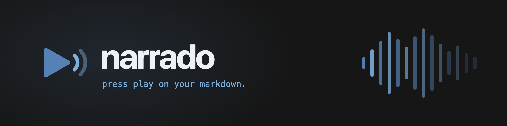
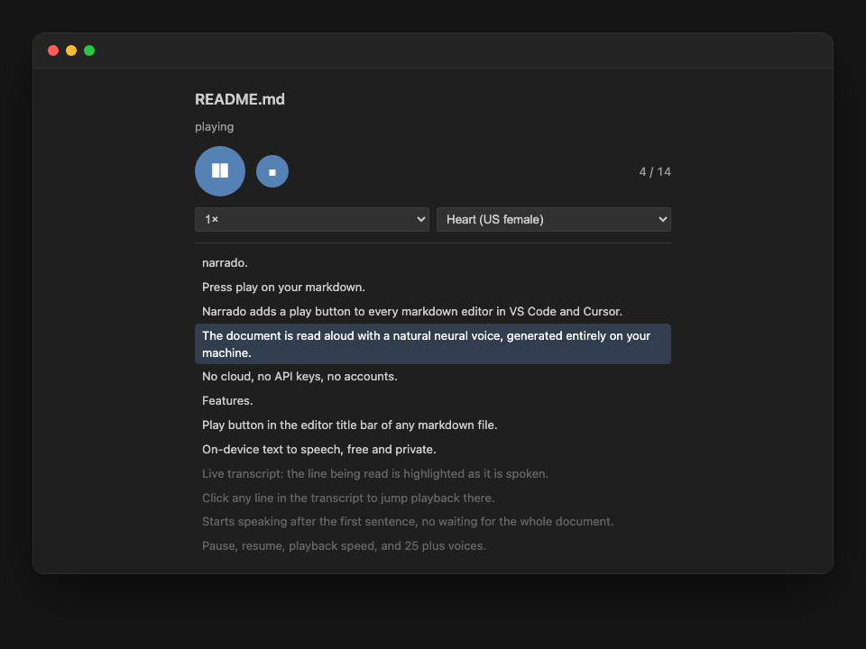

<div align="center">



**On-device text-to-speech for VS Code and Cursor — no cloud, no API keys, no accounts.**

[](https://github.com/SethMed7/narrado/releases/latest)
[](LICENSE)
[](#install)
[](https://huggingface.co/onnx-community/Kokoro-82M-v1.0-ONNX)

</div>

Narrado adds a ▶ button to every markdown file. Press it and the document is read aloud
with a natural neural voice — generated entirely on your machine by
[Kokoro-82M](https://huggingface.co/onnx-community/Kokoro-82M-v1.0-ONNX) running inside
the editor. Your text never leaves your computer.

<div align="center">



</div>

## Features

- **▶ everywhere** — status-bar button, editor title bar, and command palette
  (`Narrado: Read Aloud`); works from source view *and* rendered preview
- **On-device TTS** via [kokoro-js](https://github.com/hexgrad/kokoro) — free, private,
  works offline after the first model download
- **Live transcript** — the line being read is highlighted as it's spoken; **click any
  line to jump** playback there
- **Markdown-aware narration** — links read as their text, code blocks skipped
  (configurable), tables read row by row, URLs never read aloud
- **Instant start** — speaks after the first sentence; the rest renders while you listen
- **Pause / resume, playback speed, 25+ voices** (US/British, male/female)

## Install

Download the latest `.vsix` from
[**Releases**](https://github.com/SethMed7/narrado/releases/latest), then either:

- **In the editor**: Extensions panel → `…` menu → **Install from VSIX…** → pick the file, or
- **Terminal** (use the full path to the file):

```sh
cursor --install-extension /path/to/narrado-0.2.5.vsix   # Cursor
code --install-extension /path/to/narrado-0.2.5.vsix     # VS Code
```

Then **reload the window** (Cmd+Shift+P → "Developer: Reload Window") — already-open
windows don't pick up newly installed extensions until reloaded.

Marketplace / Open VSX: soon.

## First run

The first time you press play, the player panel downloads the Kokoro model (~80 MB, one
time). After that it works offline.

## Settings

| Setting | Default | Description |
| --- | --- | --- |
| `narrado.voice` | `af_heart` | Default Kokoro voice (`af`/`am` US, `bf`/`bm` British) |
| `narrado.readCodeBlocks` | `false` | Read code blocks aloud instead of skipping them |

## Development

```sh
bun install
bun run typecheck
bun test
bun run build      # bundles extension host (node/cjs) + webview player (browser)
bun run package    # produces narrado-x.y.z.vsix
```

Press F5 in VS Code to launch an Extension Development Host. Brand assets
(banner, social card, player shot) are authored as HTML/SVG in `assets/` and rendered
with `bunx playwright screenshot`.

## License

MIT

<div align="center">
<sub>▶ <b>narrado</b> · dusk blue on near-black · built with <a href="https://bun.sh">Bun</a> + <a href="https://github.com/hexgrad/kokoro">Kokoro</a></sub>
</div>
